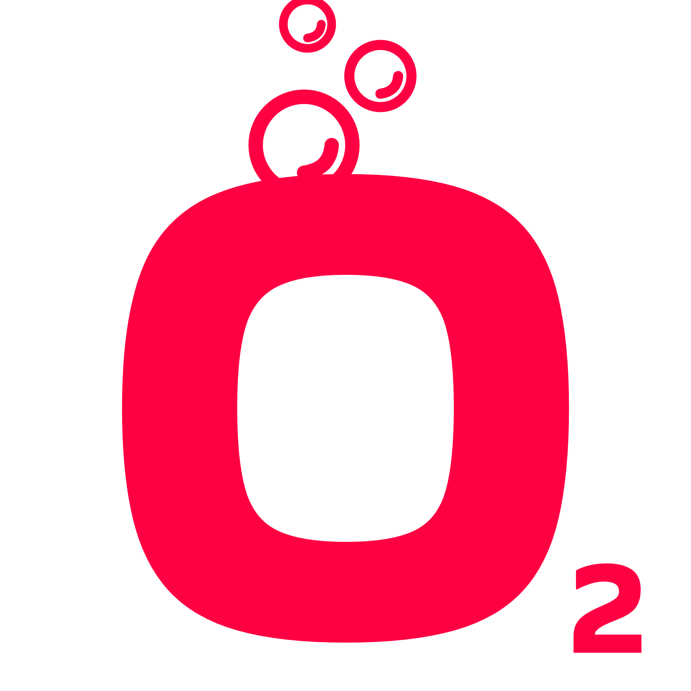
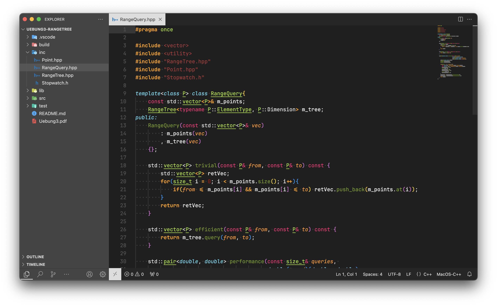
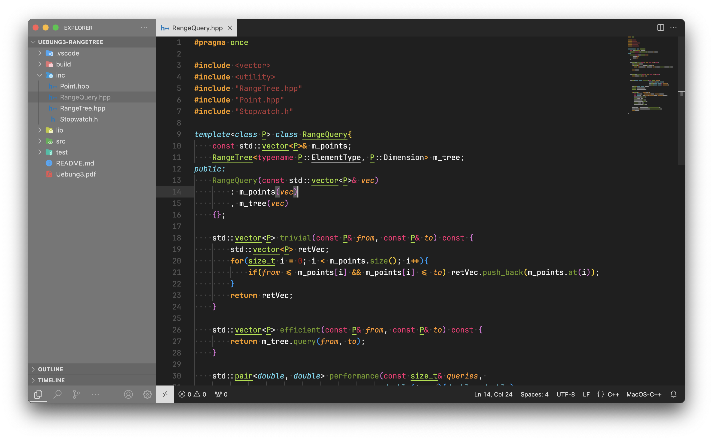

# Oxygen Theme

Dark Theme based on Monokai, but with a little more vibrancy. 

## Normal
The normal theme is used in any case where no transparency is used.



## Transparent
The transparent theme is used in any case where transparancy is used. Transparency may for example be achieved with the [Apc Customize UI++ Extension](https://github.com/drcika/apc-extension).



If you want to achieve the same look as above picture, add following settings to your Settings-JSON:
```json
"apc.electron": {
    "backgroundColor": "#00000000",
    "transparent": true,
    "vibrancy": "dark",
}
```
